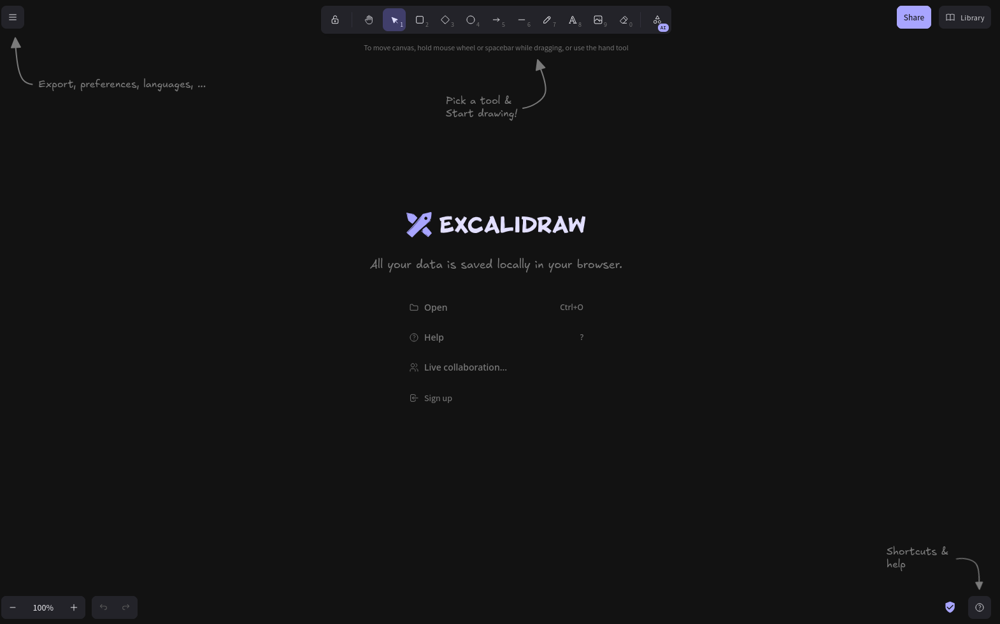

# 📝 Excalidraw Self-Hosted (sin backend)

Este contenedor te permite correr Excalidraw localmente de forma simple, ideal para tomar notas o hacer esquemas rápidos.




## 🌐 Acceso

- En tu navegador: `http://localhost:3030`

## 🧠 Notas

- Esta versión **no guarda archivos de forma persistente**. Todo se maneja en el navegador (descarga o exportación manual).
- No tiene colaboración en tiempo real (para eso necesitás el backend).

## 🐳 Uso

```bash
docker network create nointernal_home  # Solo si no existe
docker compose up -d
